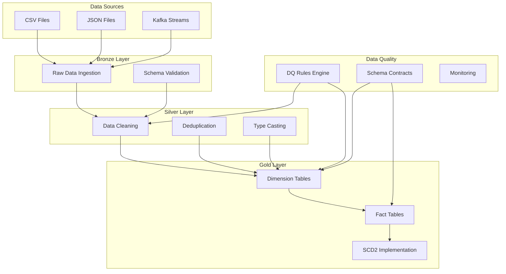

# PySpark Data Engineering Platform

A production-ready data engineering platform built with PySpark, Delta Lake, and AWS services. This project demonstrates enterprise-grade ETL pipelines with Bronze/Silver/Gold architecture, data quality enforcement, schema evolution, and cloud deployment capabilities.

## 🏗️ Architecture



## 🚀 Quick Start

### Local Development (3 Commands)

```bash
# 1. Setup environment
make venv

# 2. Run ETL pipeline
make run-local

# 3. View results
ls -la data/lake/
```

### Optional Docker Development

```bash
# Start MinIO + Spark services
make up

# View services
make logs

# Stop services
make down
```

### AWS Deployment

```bash
# Set environment variables
export AWS_REGION=us-east-1
export AWS_S3_BUCKET=your-etl-bucket
export AWS_GLUE_DATABASE=etl_database
export AWS_EMR_APPLICATION_ID=your-emr-app-id

# Run on AWS EMR Serverless
make aws
```
