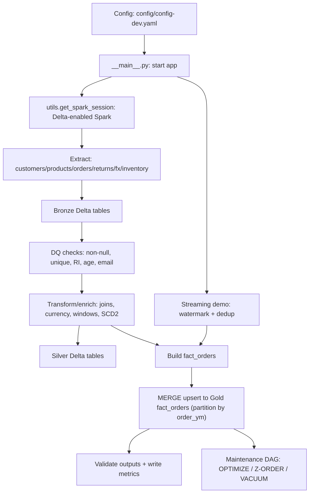

### Quick commands

- Setup
  - `python3 -m venv .venv && source .venv/bin/activate`
  - `pip install -r requirements.txt && pip install -e .`

- Run tests
  - `env -u SPARK_HOME pytest -q | cat`

- Run pipeline (dev config)
  - `env -u SPARK_HOME python -m pyspark_interview_project config/config-dev.yaml | cat`

- Inspect outputs
  - Gold: `data/lakehouse/gold/fact_orders`
  - Silver: `data/lakehouse/silver/*`
  - Bronze: `data/lakehouse/bronze/*`

- Airflow (local, non-docker)
  - `export AIRFLOW_HOME="$(pwd)/.airflow_local"`
  - `export AIRFLOW__CORE__DAGS_FOLDER="$(pwd)/airflow/dags"`
  - `airflow standalone | cat`

- Airflow env vars (compose or env)
  - `PROJECT_HOME` – project root
  - `SPARK_APP` – app path (e.g., `src/pyspark_interview_project/pipeline.py`)
  - `CONFIG_FILE` – config path (e.g., `config/config-dev.yaml`)
  - `VENV_ACTIVATE` – `.venv/bin/activate`
  - `USE_SPARK_SUBMIT` – `true` to use `SparkSubmitOperator`

- Delta maintenance DAG
  - `delta_maintenance_dag.py` runs OPTIMIZE (Z-ORDER) + VACUUM on Gold and output Delta tables.

### Architecture diagram

image.png