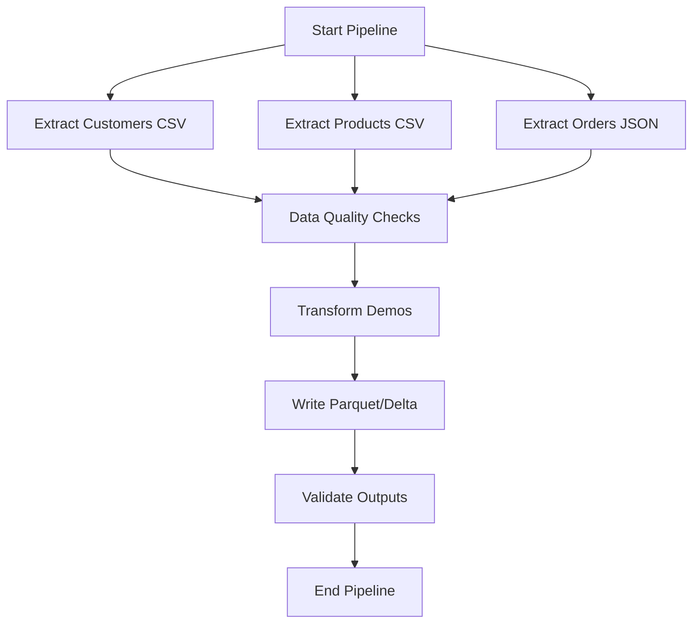

# Project Overview

This interview-ready PySpark project demonstrates a complete ETL pipeline with Delta Lake and a lakehouse layout (bronze, silver, gold), including Airflow orchestration, streaming demos, and tests.

## Highlights

- Extraction with schema enforcement from CSV and JSON sources
- Data quality checks (non-null, unique, referential integrity)
- Transformations: joins, skew mitigation, partitioning, window functions, UDFs
- SQL vs DataFrame DSL comparisons
- Loading to Parquet and Delta, partitioned for performance
- Validation of outputs

## Flow Diagram



## Running the Project

1. Ensure input files exist under `data/input_data/` (see `config/config-dev.yaml`).
2. Install dependencies and the package:
   ```bash
   python3 -m venv .venv && source .venv/bin/activate
   pip install -r requirements.txt && pip install -e .
   ```
3. Run tests:
   ```bash
   env -u SPARK_HOME pytest -q | cat
   ```
4. Run the pipeline:
   ```bash
   env -u SPARK_HOME python -m pyspark_interview_project config/config-dev.yaml | cat
   ```

Airflow: see `README.md` for simple local setup with `airflow standalone` or use `docker-compose.yml` for a containerized scheduler/webserver.


