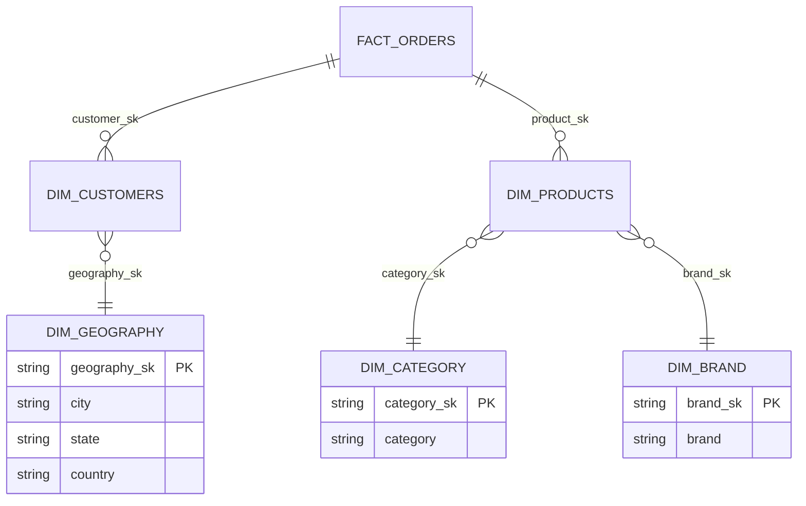

## Data Warehouse Schema

This project supports both a star schema and a snowflake schema for analytics.

### Star Schema (high-level)

```mermaid
erDiagram
    FACT_ORDERS ||--o{ DIM_CUSTOMERS : customer_sk
    FACT_ORDERS ||--o{ DIM_PRODUCTS  : product_sk
    FACT_ORDERS }o--o{ DIM_DATE      : order_ym (via date_key)

    FACT_ORDERS {
      string  order_id PK
      string  customer_sk FK
      string  product_sk  FK
      string  order_ym
      double  revenue
      int     quantity
      boolean is_returned
    }
    DIM_CUSTOMERS {
      string customer_sk PK
      string customer_id
      string first_name
      string last_name
      string email
      string city
      string state
      string country
      int    age
    }
    DIM_PRODUCTS {
      string product_sk PK
      string product_id
      string product_name
      string category
      string brand
      double price
    }
    DIM_DATE {
      string date_key PK
      date   date
      int    year
      int    month
      int    day
      int    week_of_year
      int    quarter
    }
```

### Snowflake Schema (dimensions normalized)



Notes
- Surrogate keys (`*_sk`) are deterministic SHA-256 hashes of natural keys for reproducibility.
- Fact partitioning: `order_ym` (yyyyMM). Recommended ZORDER: `order_ts`, `customer_sk`, `product_sk`.
- SCD2 is available for customers (`silver/dim_customers_scd2`) and a base version for products.


