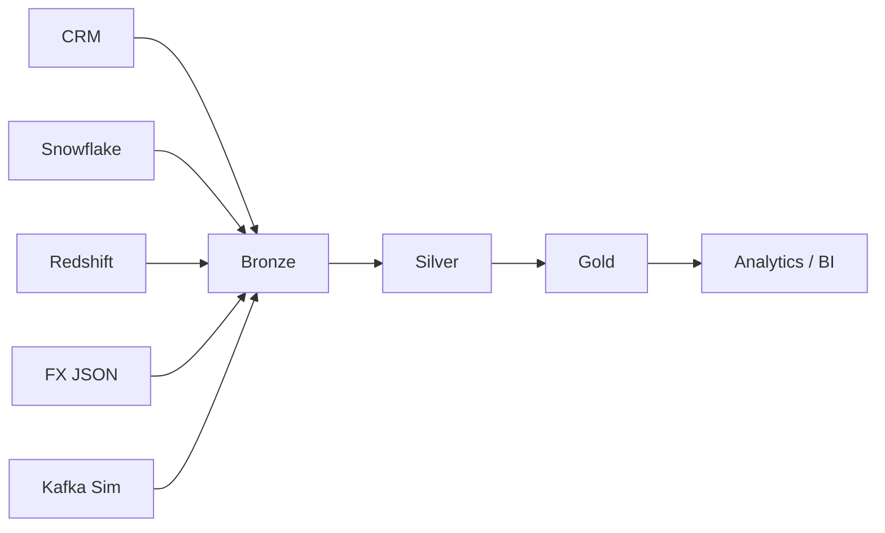
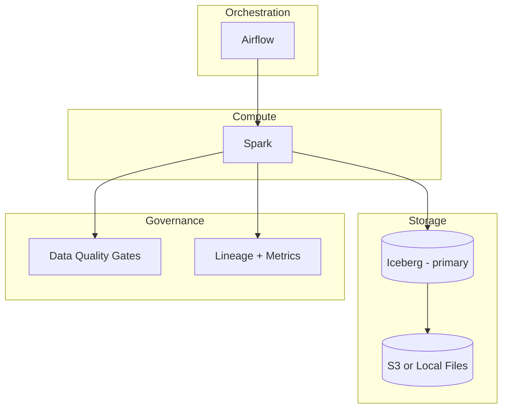

# Project A — End‑to‑End Implementation Guide (Beginner Friendly)

Welcome. This guide explains **how to run and understand the entire Project A data pipeline** from Bronze → Silver → Gold.
It is written for beginners with **step‑by‑step instructions**, **simple explanations**, and **interview‑ready framing**.

**What you will learn**
- What a data pipeline is and why Bronze/Silver/Gold exists
- How this project is organized
- How to set up your environment
- How to run every stage safely
- How to validate outputs and troubleshoot issues
- How to explain the project in interviews

---

## 0. Interview Framing (TransUnion‑Ready)

This project is designed to be **interview‑ready for a regulated data company** like TransUnion.

**Canonical stack (keep it simple):**
- **Compute**: Spark (PySpark)
- **Storage**: **Iceberg** (primary table format)
- **Orchestration**: Airflow (Docker locally)
- **Governance**: Data contracts + DQ gates + Gold Truth Tests
- **dbt**: Optional (SQL governance/testing if enabled)

**Important**: Delta is **optional/legacy**. Only mention it if the interviewer asks about alternatives.

---

## 1. Big‑Picture Architecture (Plain English)

Project A is a **data engineering pipeline** with three layers:

1. **Bronze (Raw Ingest)**
   - Data is ingested from sources like CRM, Snowflake, Redshift, FX JSON, and Kafka simulations.
   - Very little transformation. The goal is to keep raw truth.

2. **Silver (Clean + Standardized)**
   - Data is cleaned and standardized.
   - Column names and data types are consistent.
   - Duplicates are removed.

3. **Gold (Analytics‑Ready)**
   - Business‑ready facts and dimensions are created.
   - These are the tables used for dashboards and analytics.

**Storage formats**
- **Iceberg is the primary format** for Silver + Gold (ACID, time travel, schema evolution).
- **Parquet** is used for Bronze (raw files).
- **Delta** is optional/legacy and not part of the canonical interview story.

---

## 2. Pipeline Flow Diagram



---

## 3. System Architecture Diagram



---

## 4. Key Concepts (Beginner Basics)

**What is a pipeline?**
A pipeline is a sequence of steps that takes raw data and turns it into clean, reliable, and analytics‑ready datasets.

**What is Spark?**
Spark is a distributed compute engine. It lets us process large data quickly using DataFrames.

**What is a DataFrame?**
A DataFrame is a table‑like structure (rows and columns). Spark DataFrames are lazy, meaning transformations are not run until an action like `count()` or `show()` is called.

**Why not just use CSV?**
CSV is simple but slow and unstructured. Parquet and Iceberg are columnar formats that are fast, efficient, and better for analytics. Delta is an optional alternative if a team already standardizes on it.

---

## 5. Prerequisites

You need:
- **Python 3.10+**
- **Java 11 or 17** (required by Spark)
- **Spark 3.5.x** (bundled via PySpark)
- Optional: **Docker** (for Airflow)
- Optional: **AWS CLI** (for AWS integration)

Check versions:
```bash
python --version
java -version
```

---

## 6. Setup: Virtual Environment + Dependencies

Create a clean environment:
```bash
python -m venv .venv
source .venv/bin/activate

pip install -U pip
pip install -r requirements.txt
pip install -r requirements-dev.txt
```

---

## 7. Project Structure Overview

Key folders:
- `data/` → sample local data
- `jobs/` → pipeline entrypoints
- `src/project_a/` → core library + helpers
- `config/` and `local/config/` → configuration
- `tests/` → test suite

Quick view:
```bash
ls
ls jobs
ls src/project_a
```

---

## 7.1 Project Folder + File Map (What Does What)

This section explains **what every major folder and key file does**. I am skipping cache folders (like `.pytest_cache`, `.ruff_cache`), `.DS_Store`, and virtual environments because they are not part of the pipeline.

**Core folders**

| Folder | Purpose | What you should say in interviews |
|---|---|---|
| `jobs/` | Entry points for pipeline jobs | “These are the runnable jobs for ingest, transform, and DQ.” |
| `jobs/ingest/` | Bronze ingestion jobs | “These pull data from sources into Bronze.” |
| `jobs/transform/` | Silver and Gold transforms | “These standardize data and build analytics tables.” |
| `jobs/dq/` | Data quality jobs | “These enforce contracts and validate datasets.” |
| `src/project_a/` | Core library | “Reusable framework code that powers the jobs.” |
| `src/project_a/core/` | Job execution + Spark context | “Defines job lifecycle, config, and Spark session setup.” |
| `src/project_a/utils/` | Helpers | “Config loading, schemas, logging, watermarking.” |
| `src/project_a/extract/` | Readers/parsers | “Source‑specific readers for CSV/JSON.” |
| `src/project_a/schemas/` | Explicit schemas | “Schema definitions for ingestion and validation.” |
| `src/project_a/contracts/` | Data contracts | “Schema + quality contract definitions.” |
| `src/project_a/dq/` | DQ engine | “Rules and checks used by DQ jobs.” |
| `src/project_a/iceberg_utils.py` | Iceberg helpers | “Creates and writes Iceberg tables.” |
| `src/project_a/delta_utils.py` | Delta helpers (legacy) | “Optional Delta‑format IO utilities.” |
| `src/project_a/pipeline/` | Orchestration helpers | “Runs jobs in correct order.” |
| `aws/` | AWS deployment artifacts | “Glue/EMR configs, Airflow DAGs, Terraform.” |
| `aws/dags/` | Airflow DAGs | “Schedules batch pipeline runs.” |
| `config/` | Base config files | “Environment‑agnostic configuration.” |
| `local/config/` | Local configs | “Local dev overrides and paths.” |
| `data/` | Sample data | “Local Bronze/Silver/Gold data.” |
| `docs/` | Documentation | “Guides + interview docs.” |
| `tests/` | Unit tests | “Validates transforms and utilities.” |
| `dbt/` | dbt models (optional) | “Alternative modeling layer.” |

**Key files (what they do)**

| File | Purpose | Typical use |
|---|---|---|
| `run_complete_etl.py` | Runs full pipeline | One‑command local run |
| `src/project_a/pipeline/run_pipeline.py` | CLI entry for a single job | `--job bronze_to_silver` etc |
| `jobs/ingest/fx_json_to_bronze.py` | FX JSON ingestion | Normalizes FX data into Bronze |
| `jobs/ingest/snowflake_to_bronze.py` | Snowflake ingest | Loads Snowflake export data |
| `jobs/ingest/crm_to_bronze.py` | CRM ingest | Loads CRM data into Bronze |
| `jobs/ingest/redshift_to_bronze.py` | Redshift ingest | Loads Redshift data |
| `jobs/transform/bronze_to_silver.py` | Clean + standardize | Cast types, dedupe, apply rules |
| `jobs/transform/silver_to_gold.py` | Build facts/dims | Generates analytics tables |
| `jobs/dq/dq_gate.py` | DQ job runner | Runs contract checks |
| `local/config/local.yaml` | Local config | Paths + storage format + DQ settings |
| `config/contracts/*.yaml` | Contracts | Column definitions + rules |
| `src/project_a/utils/spark_session.py` | Spark builder | Configures Spark + Iceberg (Delta optional) |
| `src/project_a/utils/schema_validator.py` | Schema validator | Enforces schema consistency |
| `src/project_a/utils/watermark_utils.py` | Watermarking | Tracks latest processed time |
| `src/project_a/iceberg_utils.py` | Iceberg writes | Creates and writes Iceberg tables |
| `aws/dags/daily_batch_pipeline_dag.py` | Airflow DAG | Schedules batch pipeline |
| `docker-compose-airflow.yml` | Airflow local | Brings up Airflow via Docker |
| `Dockerfile` | Container build | Builds Spark job image |

**Where Bronze/Silver/Gold live**
- `data/bronze/` → raw ingested datasets
- `data/silver/` → cleaned standardized datasets
- `data/gold/` → analytics‑ready outputs

---


## 7.2 Tools Used (Simple Explanations)

This project uses a mix of **data engineering tools** and **supporting tools**. Here is what each does in beginner terms.

**Core data tools**
- **Apache Spark (via PySpark)**: The main engine that reads, transforms, and writes large datasets. It works on DataFrames (like tables).
- **Parquet**: A fast columnar file format. Great for analytics but not ACID.
- **Apache Iceberg**: The primary table format here. ACID, time travel, schema evolution; works with catalogs.
- **Delta Lake**: Optional alternative table format (not required for this project’s canonical flow).

**Orchestration and modeling**
- **Apache Airflow**: Schedules and runs jobs in order. Adds retries, SLAs, and dependencies.
- **dbt** (optional): SQL‑based transformation and documentation layer.

**Data quality and governance**
- **Contracts**: Machine‑readable schema rules that define required columns, types, and constraints.
- **DQ Gates**: Checks like not‑null, uniqueness, and referential integrity.
- **Schema evolution gate**: Blocks breaking schema changes between runs.
- **Lineage + Metrics**: Tracks what tables were read/written and job runtime details.

**Local developer tools**
- **pytest**: Runs automated tests.
- **Docker**: Runs Airflow locally.
- **Run scripts**:
  - `run_complete_etl.py` = run full pipeline
  - `scripts/run_job.sh` = run one job
  - `scripts/run_comprehensive_dq.sh` = run full DQ
  - `scripts/check_bronze_data.py` = sanity check Bronze data
  - `scripts/generate_schema_baselines.py` = build schema baselines

---

## 7.3 Data Types (Beginner Explanation)

This pipeline uses common data types. You’ll see these across Spark, Parquet, Iceberg, and contracts.

- **String**: text values like IDs, emails, and statuses. Example: `"CUST00001"`
- **Integer**: whole numbers. Example: `quantity = 4`
- **Double / Float**: decimal numbers. Example: `amount_usd = 123.45`
- **Decimal**: fixed precision decimals for money. Example: `Decimal(10,2)` to avoid rounding errors
- **Date**: calendar date only. Example: `2025-01-31`
- **Timestamp**: date + time. Example: `2025-01-31 12:05:33`
- **Boolean**: true/false. Example: `is_active = true`

**Important concepts**
- **Nullability**: If a column can be missing. Some keys are marked non‑nullable.
- **Primary Key (PK)**: A unique ID for each row (e.g., `order_id`).
- **Foreign Key (FK)**: A column that references another table (e.g., `orders.customer_id`).

---

## 7.4 Data Sources (What Feeds Bronze)

**CRM (CSV)**
- Tables: Accounts, Contacts, Opportunities
- Purpose: Sales and customer relationship data
- Example fields: `account_id`, `contact_id`, `opportunity_id`, `amount`, `stage`

**Snowflake (CSV export simulation)**
- Tables: Customers, Orders, Products
- Purpose: Core business transactions
- Example fields: `customer_id`, `order_id`, `product_id`, `amount_usd`, `order_date`
 - Incremental batches: `data/bronze/snowflake/orders/daily/date=YYYY-MM-DD/`

**Redshift (CSV export simulation)**
- Table: Customer behavior events
- Purpose: User browsing and engagement
- Example fields: `session_id`, `event_type`, `event_date`, `time_spent_seconds`
 - Incremental batches: `data/bronze/redshift/behavior/daily/date=YYYY-MM-DD/`

**FX JSON (JSON Lines)**
- Table: FX rates
- Purpose: Currency conversion and normalization
- Example fields: `trade_date`, `base_ccy`, `counter_ccy`, `rate`

**Kafka (CSV simulation)**
- Table: Order event stream
- Purpose: Streaming‑style events like `ORDER_CREATED`
- Example fields: `event_id`, `order_id`, `customer_id`, `event_type`, `event_time`
 - Incremental batches: `data/bronze/kafka/events/daily/date=YYYY-MM-DD/`

---

## 7.5 Transformations (Detailed but Simple)

**Bronze → Silver (Cleaning + Standardizing)**
- **Schema enforcement**: Ensure required columns exist and types are correct
- **Column standardization**: Normalize names (`order_date`, `amount_usd`, etc.)
- **Deduplication**: Remove duplicate orders or customers
- **Type casting**: Convert strings into dates, integers, decimals
- **Fix bad records**: Filter or quarantine invalid rows
- **Contracts check**: Fail fast if schema/PK constraints break

**Silver → Gold (Analytics‑Ready)**
- **Dimensions**: Build `dim_customer`, `dim_product`
- **Fact table**: Build `fact_orders` from orders joined to customers/products
- **Aggregations**: Create rollups or analytics views
- **DQ validation**: Ensure key integrity and semantic rules

---

## 7.6 Major Work in This Project (What It Actually Does)

- **Ingestion**: Pulls raw data into Bronze with explicit schemas
- **Standardization**: Cleans, aligns, and deduplicates data in Silver
- **Modeling**: Builds Gold facts and dimensions for analytics
- **Quality**: Runs DQ gates, schema evolution checks, and reconciliation
- **Observability**: Captures lineage and metrics for pipeline health
- **Publishing**: Optional exports to Snowflake/Redshift
- **Orchestration**: Airflow schedules jobs with retries and SLAs

---
## 8. Configuration (Local vs Prod)

Local configuration lives here:
- `local/config/local.yaml`

This file controls:
- Paths to data (`paths.bronze_root`, `paths.silver_root`, `paths.gold_root`)
- Storage format (Iceberg primary; Parquet fallback; Delta optional)
- Spark options
- DQ strictness

Example DQ relaxed mode for learning:
```yaml
# local/config/local.yaml
# This prevents failure when data is incomplete
# (good for demos and learning)
dq:
  fail_on_error: false
```

---

## 9. How Spark is Built (Important)

This project automatically builds Spark with:
- Iceberg support (enabled by default in local config)
- Delta Lake support (optional, only if `delta-spark` is installed and configured)

Local runs are forced to use **PySpark’s bundled Spark** (not Homebrew Spark 4), to avoid version conflicts.

---

## 10. Run the Pipeline Step by Step

### Step 1 — FX JSON → Bronze
Loads FX JSON and writes normalized Bronze data.
```bash
python3 -m project_a.pipeline.run_pipeline   --job fx_json_to_bronze   --env local   --config local/config/local.yaml
```

### Step 2 — Snowflake/CRM/Redshift → Bronze
Simulated ingestion from multiple sources.
```bash
python3 -m project_a.pipeline.run_pipeline --job snowflake_to_bronze --env local --config local/config/local.yaml
python3 -m project_a.pipeline.run_pipeline --job crm_to_bronze --env local --config local/config/local.yaml
python3 -m project_a.pipeline.run_pipeline --job redshift_to_bronze --env local --config local/config/local.yaml
```

### Step 3 — Bronze → Silver
Cleans, standardizes, and deduplicates data.
```bash
python3 -m project_a.pipeline.run_pipeline --job bronze_to_silver --env local --config local/config/local.yaml
```

### Step 4 — Silver → Gold
Builds dimensional model + analytics tables.
```bash
python3 -m project_a.pipeline.run_pipeline --job silver_to_gold --env local --config local/config/local.yaml
```

### One‑Command Full Pipeline
Use the helper script:
```bash
python3 run_complete_etl.py --config local/config/local.yaml --env local
```

---

## 11. Screenshots of Outputs

Below are sample output “screenshots” generated from your local run.


---

## 12. Validate Outputs

Check Gold output directories:
```bash
ls data/gold
```

Load and inspect with Spark:
```python
from project_a.utils.spark_session import build_spark
from project_a.utils.config import load_config_resolved

config = load_config_resolved('local/config/local.yaml')
spark = build_spark(config)

fact = spark.read.parquet('data/gold/fact_orders')
print(fact.count())
fact.show(5, False)

spark.stop()
```

---

## 13. Data Quality (DQ) Gates

DQ checks validate:
- Not‑null columns
- Uniqueness
- Range checks
- Schema contracts

For strict mode:
```yaml
dq:
  fail_on_error: true
```

DQ jobs:
```bash
python3 -m project_a.pipeline.run_pipeline --job dq_silver_gate --env local --config local/config/local.yaml
python3 -m project_a.pipeline.run_pipeline --job dq_gold_gate --env local --config local/config/local.yaml
```

---

## 14. Schema Evolution Gate (Breaking‑Change Blocker)

This project enforces **schema evolution rules** on curated layers (Silver/Gold).
It stores a baseline schema per table in:

```
artifacts/schema_baselines/<layer>/<table>.json
```

**What is considered breaking?**
- Removing columns
- Changing data types (unless safe widening)
- Making a non‑nullable column nullable
- Adding non‑nullable columns in backward‑compatible mode

**Why this matters in interviews:**
It prevents silent breaking changes from corrupting downstream analytics.

---

## 15. Profiling + Reconciliation (Real‑World DQ)

This project now includes **sampling‑based profiling**, **data‑drift detection**, and **row‑level reconciliation**.
- **Profiling** computes null rates, distinct counts, min/max, and top values on samples.
- **Drift detection** compares current profiles to stored baselines and flags large changes.
- **Reconciliation** checks key coverage between layers (e.g., orders_silver → fact_orders).

Profiles are written to:
```
artifacts/dq/profiles/<layer>/<table>/profile_<timestamp>.json
```

Drift baselines are stored in:
```
artifacts/dq/profile_baselines/<layer>/<table>.json
```

Run reconciliation only:
```bash
python3 scripts/reconcile_counts.py --config local/config/local.yaml
```

---

## 16. Bronze Data Sanity Check (Realism Test)

You can quickly validate that Bronze data “looks real” using:

```bash
python3 scripts/check_bronze_data.py --config local/config/local.yaml --sample-rows 20000
```

This checks:
- IDs are mostly non‑null and unique
- Dates are not far in the future
- Numeric columns don’t go negative

The report is written to:
```
artifacts/dq/bronze_sanity_report.json
```

---

## 17. Audit Logs + Alerts (Production Observability)

Every job run emits:
- **Audit log** (job status, duration, env)
- **Alert log** (failures + SLA breaches)

Files:
```
artifacts/audit/pipeline_run_audit.jsonl
artifacts/alerts/alerts.jsonl
```

---

## 18. Backfill + Retention (Senior Engineer Patterns)

Backfill a date range:
```bash
python3 scripts/backfill_range.py --start-date 2026-01-01 --end-date 2026-01-07 --jobs snowflake_to_bronze,bronze_to_silver --config local/config/local.yaml
```

Retention cleanup (delete old partitions):
```bash
python3 scripts/retention_cleanup.py --config local/config/local.yaml --days 30
```

---

## 19. Pipeline SLO Checks (Runtime + Freshness)

You can validate pipeline SLOs after the run:
```bash
python3 run_complete_etl.py --config local/config/local.yaml --env local --with-slo
```

This checks:
- Total runtime vs SLO
- Data freshness (max order_date age)

---

## 20. Iceberg vs Parquet (Delta Optional)

- **Parquet** = file format only (fast, simple, not ACID)
- **Iceberg** = table format with ACID + catalog integration
- **Delta Lake** = optional alternative (also ACID), not required in this project’s canonical flow

In this project:
- Local runs use Iceberg by default; Bronze stays Parquet.
- Delta is only used if you explicitly enable it.

---

## 21. Real Kafka Stack (Streaming)

This project now includes a **real Kafka stack** via Docker Compose.

Start Kafka:
```bash
docker compose up -d zookeeper kafka kafka-init
```

Produce events (from CSV seed):
```bash
python3 scripts/produce_kafka_events.py \
  --bootstrap localhost:9092 \
  --topic orders_events \
  --seed-file data/bronze/kafka/stream_kafka_events_100000.csv \
  --limit 2000
```

Run the streaming job:
```bash
scripts/run_kafka_stream.sh local/config/local.yaml local
```

This will write live Kafka events into Bronze.

**Schema registry + DLQ**
- Schema registry file: `config/schema_registry/kafka/orders_events.json`
- Invalid events go to: `data/bronze/kafka/dlq/orders_events`

---

## 22. Airflow (Optional)

Airflow can orchestrate the pipeline with scheduling and retries.

Example Docker usage:
```bash
# Example (if docker-compose-airflow.yml exists)
docker compose -f docker-compose-airflow.yml up -d
```

Open Airflow UI (default `http://localhost:8080`) and trigger the DAG.

---

## 23. dbt (Optional)

If dbt is included:
```bash
ls dbt
cd dbt
python -m dbt debug
python -m dbt run
```

---

## 24. Tests

Run tests:
```bash
pytest -q
```

If tests fail, check Spark version, config paths, and missing modules.

---

## 25. Common Errors + Fixes

**Error: Spark can’t parse timestamps**
- Fix: use robust parsing patterns in the extractor.

**Error: Iceberg table not found**
- Normal on first run. Code falls back to path reads.

**Error: Missing DQGate import**
- Fixed by compatibility wrapper in `project_a.dq.gate`.

**Error: Spark 4.x mismatch**
- Local Spark is forced to PySpark distribution (Spark 3.5).

---

## 26. FAQ — Interview‑Style Q&A

**Q1: Why do you use Bronze/Silver/Gold?**
A: It separates concerns. Bronze keeps raw truth, Silver standardizes, Gold optimizes for analytics.

**Q2: How do you guarantee data quality?**
A: Contracts + DQ gates (not‑null, uniqueness, range checks) and fail‑fast in strict mode.

**Q3: Why Iceberg instead of only Parquet?**
A: Iceberg adds ACID guarantees, time travel, schema evolution, and catalog integration.

**Q4: How do you avoid duplicate data?**
A: Deduplication logic in Silver + merge/upsert strategies.

**Q5: How does this scale in production?**
A: Spark on a managed runtime (local or AWS), Iceberg tables in object storage, and Airflow for orchestration.

**Q6: What happens if a job fails halfway?**
A: Jobs are idempotent, use overwrite/merge patterns, and produce run audits for recovery.

**Q7: How do you handle schema drift?**
A: Explicit schemas + schema drift checks and contract validation.

**Q8: How do you trace lineage?**
A: Lineage emitters record job inputs/outputs and metrics (OpenLineage‑style).

**Q9: How would you test this pipeline?**
A: Unit tests for transforms + integration tests for stage‑level validation.

**Q10: What would you improve?**
A: Add CI/CD, production secrets manager, and full end‑to‑end integration tests.

---

## 27. Interview‑Ready Summary

When asked to explain this project, say:

- It ingests multi‑source data into Bronze (raw).
- Standardizes to Silver with explicit schema and data contracts.
- Builds Gold fact/dim tables (analytics‑ready).
- Includes DQ gates, lineage logging, and Iceberg (primary) with optional Delta.
- Runs locally with Airflow and can scale to AWS when needed.

This gives you a strong, production‑grade story.
